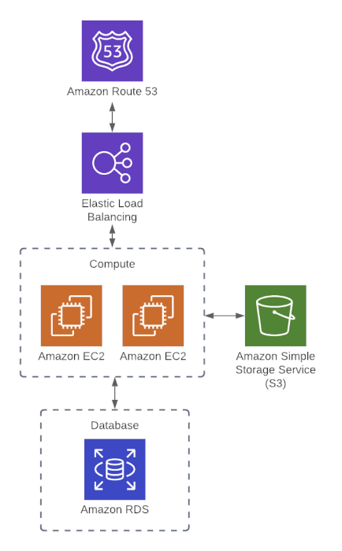

# Terraform -- Getting a Better Understanding

## Overview

Found new infrastructure to build. this will allow me to get some hands on experience with different AWS services using Terraform. Following this [Guide](https://www.youtube.com/watch?v=7xngnjfIlK4&t=130s)  and provided access this [GitHub Repo](https://github.com/sidpalas/devops-directive-terraform-course) will give me a better understanding using different AWS Services along with Terraform Infrastructure.

-----


## Getting Started

## Web-App

Generic web application architecture including:
- EC2 instances
- S3 bucket
- RDS instance
- Load balancer
- Route 53 DNS config

This example will be refined and improved in later modules.

## Architecture


----

### Setup IAM Role
using ACG select the provided `ACCESS KEY ID`&& `Secret Access Key`

### TODO:

 - walk through web app TF config
	 - backend + provider config
	 - ec2 instances
	 - s3 bucket
	 - vpc
		 - subnet
	- security groups + rules
	- application load balancer
		- alb target group + attachment
	- route 53  zone + record
	- rds instance

-----

### How Terraform Stores Current State

[Terraform](https://www.terraform.io) stores cluster state data in
`.terraform/terraform.tfstate` by default. Configuring the `prefix` and
`bucket` variables will enable storage in a remote bucket instead and is
useful for sharing state among multiple administrators. The following
resources provide some useful background information.

### AWS Backend

for the S3 bucket for the aws backend

> AFTER RUNNING TERRAFORM APPLY (WITH LOCAL BACKEND)
  YOU WILL UNCOMMENT THIS CODE THEN RERUN TERRAFORM INIT
  TO SWITCH FROM LOCAL BACKEND TO REMOTE AWS BACKEND


```
 backend "s3" {
  bucket = "provide-unique-s3-bucket-name"
  key = "provide/directory/path/for/.tfstate/terraform.tfstat"
  region = "us-east-1"
  dynamodb_table = "terraform-state-locking" *ignore this block*
  encrypt = true      
  }
  ```
----

## Guides
- [Complete Terraform Guide](https://www.youtube.com/watch?v=7xngnjfIlK4&t=130s)
- [GitHub Repo](https://github.com/sidpalas/devops-directive-terraform-course)

----

### Running Terraform

Run the following to ensure ***terraform*** will only perform the expected
actions:

```sh
terraform fmt
terraform validate
terraform plan
terraform init
```

### Tearing Down the Terraformed Cluster

Run the following to verify that ***terraform*** will only impact the expected
nodes and then tear down the cluster.

```sh
terraform plan
terraform destroy
```
----

# Documentation

## Variables

### Variable block

must define variable block

```
variable "var_name" {
  type = string
}
```

### Variable types
- string
- number
- bool
- list(<TYPE>)
- set(<TYPE>)
- map(<TYPE>)
- object({<ATTR NAME> = <TYPE>, ... })
- tuple([<TYPE>, ...])

### Variable files
`variables.tfvars` (or `<FILENAME>.auto.tfvars`) automatically applied 

### Apply default
`terraform apply`

### Apply a different variable file
`terraform apply -var-file=another-variable-file.tfvars`

### Passing Variable via Prompt
If value not specified, Terraform will prompt for value. (this is okay for testing... but don't depend on it since you should be automating things!)
```
  var.db_pass
  password for database

  Enter a value:
```

### Passing Variables via CLI
`terraform apply -var="db_pass=$DB_PASS_ENV_VAR"`

## Local Variables

Allows you to store the value of expression for reuse but doesn't allow for passing in values 
```
locals {
  extra_tag = "extra-tag"
}
```

## Output Variables

Allows you to output some value  (which might not be known ahead of time).

For example it might be useful to know the IP address of a VM that was created:

```
output "instance_ip_addr" {
  value = aws_instance.instance.private_ip
}
```

Sample output:
```
db_instance_addr = "terraform-20210504182745335900000001.cr2ub9wmsmpg.us-east-1.rds.amazonaws.com"
instance_ip_addr = "172.31.24.95"
```

Will be output after `terraform apply` or `terraform output`


---

[tfhome](https://www.terraform.io)
[tfdocs](https://registry.terraform.io/providers/hashicorp/aws/latest/docs)